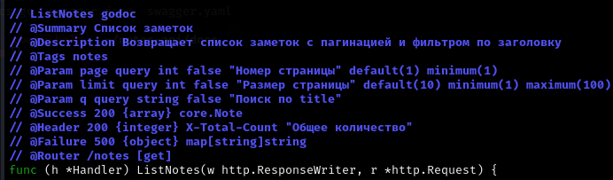
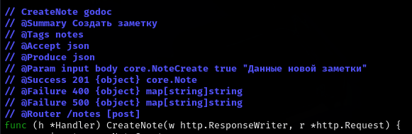
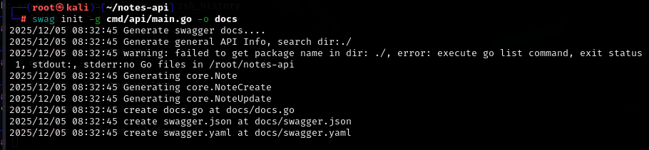
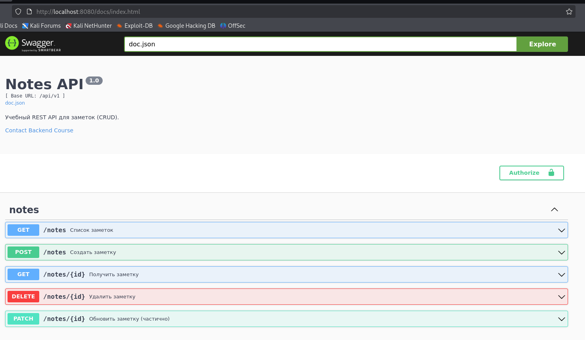
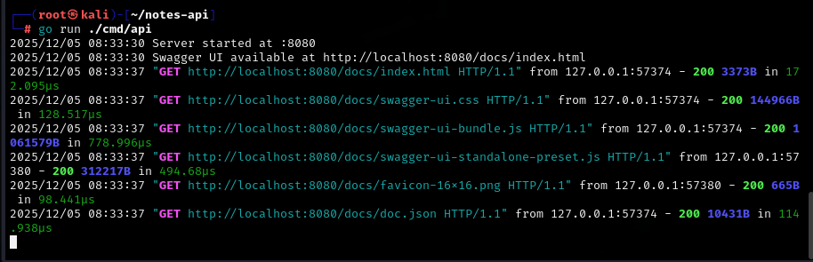

## практическа работа 11

### ЭФМО-02-25 Фомичев Александр Сергеевич

#### Структура проекта
```
notes-api/
 ├─ cmd/api/main.go
 ├─ internal/
 │   ├─ http/
 │   │   ├─ router.go
 │   │   └─ handlers/notes.go
 │   ├─ core/
 │   │   ├─ note.go
 │   │   └─ service/note_service.go
 │   └─ repo/
 │       └─ note_mem.go
 ├─ docs/
 │      ├─ docs.go
 │      ├─ swagger.json
 │      └─ swagger.yaml
 ├─ api/openapi.yaml
 └─ go.mod

```
### Цели:
1) Освоить основы спецификации OpenAPI (Swagger) для REST API.
2) Подключить автогенерацию документации к проекту app.
3) Научиться публиковать интерактивную документацию на эндпоинте GET /docs.
4) Синхронизировать код и спецификацию через комментарии-аннотации.
5) Подготовить процесс обновления документации.

## реализация

В этом разделе описывается реализация ключевых компонентов Swagger документации с объяснением назначения каждого изменения и его роли в системе.

Файл: cmd/api/main.go
Точка входа приложения с Swagger аннотациями верхнего уровня.

Определяет метаинформацию API для генерации документации.

Добавляет маршрут для интерактивной документации.

Архитектурное значение:

- Централизованная конфигурация метаданных API
- Автоматическое предоставление документации через веб-интерфейс
- Стандартизированное описание API для клиентов

Файл: internal/core/note.go
Расширение моделей данных Swagger аннотациями.

Предоставляет примеры данных для Swagger UI.

Архитектурное значение:

- Стандартизирует форматы запросов и ответов
- Предоставляет примеры для тестирования в документации
- Отделяет DTO от доменных моделей

Файл: internal/http/handlers/notes.go
Добавление аннотаций к обработчикам HTTP запросов.

Ключевые компоненты:

Аннотации:





Архитектурное значение:

- Документирует поведение API на уровне кода
- Обеспечивает автоматическую синхронизацию документации
- Предоставляет информацию о кодах ответов и типах данных

Файл: internal/http/router.go
Оптимизация структуры маршрутов для совместимости со Swagger.

Архитектурное значение:

- Обеспечивает согласованность между аннотациями и фактическими маршрутами
- Упрощает группировку связанных эндпоинтов в документации
- Подготавливает структуру для будущего расширения API

## тестирование

### Команда генерации документации 


### работа страницы swagger ui


### терминал работы страницы swagger ui


